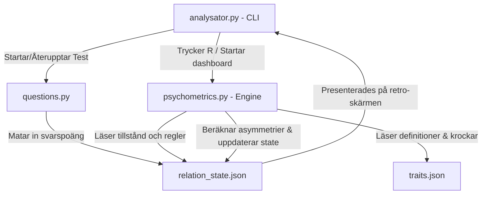

# Systemarkitektur - Psykometrisk Relationsanalysator

Detta dokument beskriver den tekniska arkitekturen och dataflödet för Psykometrisk Relationsanalysator.

## Översikt & Dataflöde

Systemet är uppdelat i en interaktiv terminal-frontend (`analysator.py`) och en ren regelbaserad beräkningsmotor (`psychometrics.py`). Data sparas i `relation_state.json`.



## Data- och Override-säkring

För att skydda manuella justeringar gjorda av operatören (eller AG) efter djupintervjuer från att skrivas över av standardberäkningen, lagras varje mätpunkt i en trippelstruktur:

```json
"anxiety_score": {
  "computed": 0.72,
  "override": 0.85,
  "override_reason": "Justering efter djupintervju: D uppvisar högre stressreaktivitet än självskattat.",
  "effective": 0.85
}
```

- **computed**: Värdet som beräknas rent algoritmiskt från frågesvaren. Skrivs endast av beräkningsmotorn.
- **override**: Värdet som anges manuellt av operatören (eller via AG-chatten). Rörs aldrig av beräkningsmotorn.
- **effective**: Det slutgiltiga värdet som används i analysen och krockberäkningarna. Beräknas som `override if override is not None else computed`.

## Atomära Skrivningar

För att förhindra att JSON-filen blir korrupt under skrivning (vilket kan ske vid manuella redigeringar eller programfel), tillämpar `analysator.py` atomär skrivning:
1. Skriv det nya tillståndet till `relation_state.json.tmp`.
2. Försök läsa och parsa `.tmp`-filen.
3. Om parsing lyckas, ersätt `relation_state.json` med `.tmp`-filen.
4. Om parsing misslyckas, behåll originalfilen och kasta ett fel (eller visa varning i terminalen).
